# FinBank Data Platform — Pipeline End-to-End de Ingeniería de Datos

**Prueba Técnica — Ingeniero de Datos | DataKnow Colombia**
**Candidato:** Brayan Alejandro Cifuentes Quiroga
**Escenario:** A — Banca (FinBank S.A.)
**Fecha de entrega:** 31 de agosto de 2026

---

## 1. Sector Elegido y Plataforma Cloud

### 1.1 Sector: Escenario A — Banca (FinBank S.A.)

De los escenarios disponibles en la prueba, elegi el sector bancario por las siguientes razones:

- **Experiencia directa aplicable**: Desde mi experiencia en el ssector asegurador y financiero fue un entorno similar, construyendo pipelines Bronze→Silver→Gold sobre Azure con patrones muy similares a los que exige este escenario razon por la cual queria poner a prueba con este escenario.
- **Balance de complejidad y volumen**: el escenario bancario combina datos de clientes, productos, sucursales con datos transaccionales de alto volumen movimientos financieros y reglas de negocio bastante interesatnes que investigar para cumplir y hacer un correcto funcionamiento del sistema.

### 1.2 Plataforma cloud: Microsoft Azure

Se eligió Azure (Azure Data Factory + Azure Databricks + ADLS Gen2) sobre otras opciones (AWS, GCP) por:

- **Conocimiento previo consolidado**: es la plataforma con la que mas familiaridad he tenido,lo que permitió invertir el tiempo disponible en el desarrollo de esta prueba y no en aprender una plataforma nueva desde cero.
- **Integración nativa entre servicios**: ADF y Databricks tienen buenaintegracion que simplifica la separación de responsabilidades.
- **Terraform como IaC**:Terraform es maduro y cubre todos los recursos necesarios  sin necesitar herramientas adicionales.

## 2. Resumen Ejecutivo

Este proyecto implementa un pipeline de datos end-to-end para FinBank S.A, siguiendo la arquitectura Medallion (Bronze → Silver → Gold) sobre Microsoft Azure. El pipeline ingesta datos desde una base de datos transaccional (Azure SQL Database), los limpia y valida progresivamente, y produce un modelo dimensional listo para análisis de negocio.

**Componentes principales:**
- **Orquestación:** Azure Data Factory (ADF)
- **Procesamiento:** Azure Databricks (PySpark, Delta Lake)
- **Almacenamiento:** Azure Data Lake Storage Gen2 (ADLS Gen2)
- **Infraestructura como código:** Terraform
- **Gobierno de datos:** Unity Catalog (Databricks)
- **Monitoreo y alertas:** Azure Monitor, Log Analytics

---

## 3. Generación de Datos Sintéticos y Modelo Relacional (Fase 1)

### 3.1 Cumplimiento de requisitos 

| Requisito del documento | Evidencia |
|---|---|
| Semilla aleatoria fija y reproducible | `seed=42` en `config.yaml`, usado en todos los generadores |
| Distribuciones realistas (no uniformes puras) | Edades con distribución normal; movimientos concentrados en horario 8am-10pm; montos con distribución log-normal por tipo de producto |
| Integridad referencial | Todo `id_cli`/`cod_prod` en tablas de hechos existe en las dimensiones — validado explícitamente en Silver (`validar_fk`) |
| ~5% de nulos en campos no críticos | `score_buro` con 5% de nulos (confirmado en el reporte de calidad de ejecuciones reales: `{'score_buro': 5.0}`) |
| Cobertura temporal de 12 meses | Rango completo de fechas sintéticas, 12 meses |
| mas de 3 anomalías intencionales documentadas | Duplicados exactos, fechas fuera de rango, montos inválidos menores a 0, IDs huérfanos |
| mas de 2 formatos de salida distintos | CSV  + JSON  |
| Carga en base de datos SQL relacional | Azure SQL Database |
| Scripts versionados y reproducibles | `data-generation/*.py` + `config.yaml` en el repositorio |
| Diagrama ER en `/docs` | `docs/diagrama_er.png`  |
| Evidencia de carga SELECT COUNT(*) | Función `verificar_carga()` en `load_data_to_sql.py`, corrida automáticamente |

### 3.2 Generación y carga 

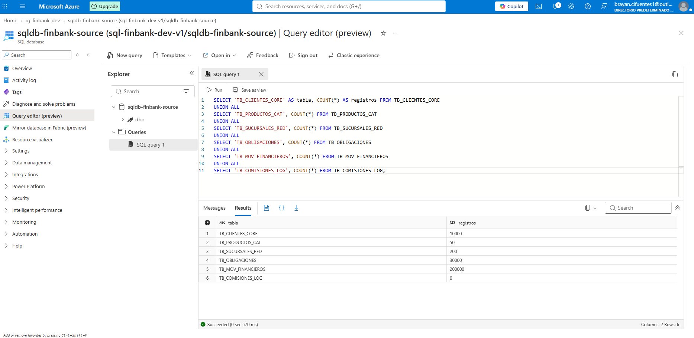

El script `load_data_to_sql.py` crea las 6 tablas  y carga los datos en lotes de 20.000 registros, limpiando valores NaN de pandas a NULL de SQL antes de insertar. Al finalizar, `verificar_carga()` imprime el conteo real de cada tabla como evidencia directa de que la carga fue completa y exitosa.

### 3.3 Las 4 anomalías intencionales (en `TB_MOV_FINANCIEROS`)

| # | Anomalía | Cómo se generó | Cómo la detecta el pipeline |
|---|---|---|---|
| 1 | Duplicados exactos | Filas repetidas a propósito, sin restricción de llave primaria única en el origen | `dropDuplicates(["id_mov"])` en Silver |
| 2 | Fechas fuera de rango | Registros con `fec_mov` en el año 2030 (futuro) o anteriores a 2015 | Filtro de rango válido en Silver, registrados en `errores_pipeline` |
| 3 | Montos inválidos | `vr_mov <= 0` | Filtro `vr_mov > 0` en Silver, registrados en `errores_pipeline` |
| 4 | IDs huérfanos | `id_cli` que no existe en `TB_CLIENTES_CORE` | `validar_fk` en Silver, registrados en `errores_pipeline` |

Estas 4 anomalías se verifican en cada ejecucion del pipeline, ver ejemplo de detección real en la sección 6.2.

### 3.4 Diagrama Entidad-Relación

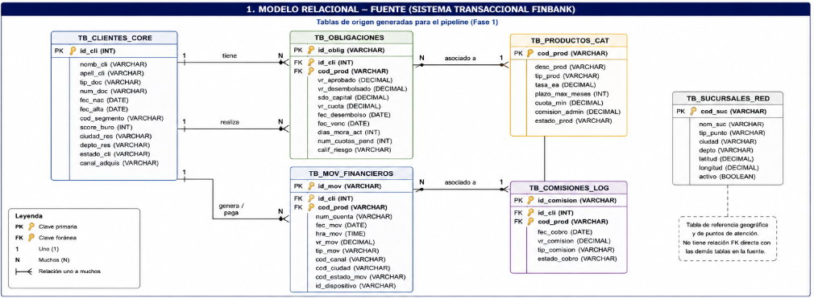

El modelo relacional de origen sigue un esquema de banca simplificado: TB_CLIENTES_CORE y TB_PRODUCTOS_CAT como catálogos centrales, referenciados por TB_OBLIGACIONES, TB_MOV_FINANCIEROS y TB_COMISIONES_LOG; TB_SUCURSALES_RED es un catálogo independiente de puntos de atención, usado en Gold para enriquecer la dimensión de canal/geografía.

---

## 4. Arquitectura

### 4.1 Arquitectura lakehouse

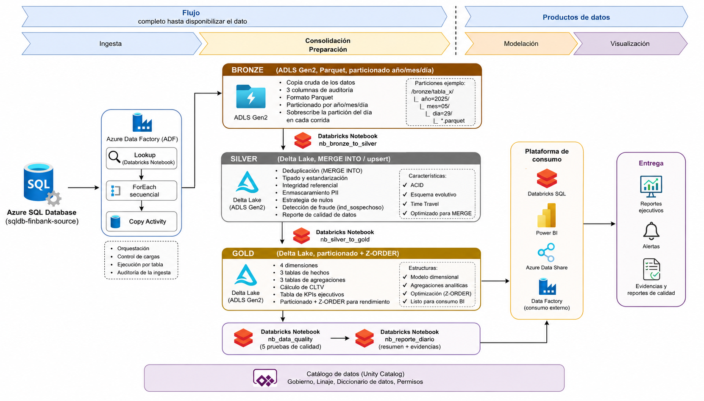

### 4.2 Orquestación (Azure Data Factory)
 
- **`pl_ppal_data_ingest`**: pipeline de Bronze. Lee la configuración de las 6 tablas desde una tabla Delta de control (`control_ingestas`), itera secuencialmente sobre ellas, copia cada una desde SQL con lógica dinámica Full/Delta Load, actualiza el checkpoint y registra el log de ejecución. Incluye manejo de errores por tabla (una tabla fallando no detiene a las demás) y detección de anomalías de volumen.
- **`pl_finbank_master`**: pipeline maestro. Encadena `pl_ppal_data_ingest` → transformación Silver → transformación Gold → pruebas de calidad → reporte diario, con dependencias explícitas `Succeeded` entre cada etapa.
- **Trigger diario**: programado a las 02:00 hora Bogotá (desactivado por defecto para control de costos durante el desarrollo; activable con un cambio en Terraform).
### 4.3 Por qué esta arquitectura
 
- **ADF solo orquesta, Databricks transforma**: separación de responsabilidades clara, ADF mueve datos y coordina; toda la lógica de negocio vive en notebooks que se realizan.
- **Delta Lake en todas las capas**: transacciones ACID, capacidad de `MERGE INTO` (upsert), versionado, y mejor rendimiento de consulta que Parquet plano.
- **Un pipeline genérico con `ForEach`, no seis pipelines separados**: evita repetir la misma lógica seis veces; agregar una séptima tabla en el futuro solo requiere una fila nueva en la tabla de control, sin tocar el pipeline.
- **Unity Catalog para gobierno real**: Unity Catalog aplica permisos por usuario — ver sección 9 (Gobierno).
---
 
## 5. Cómo Desplegar
 
### 5.1 Prerrequisitos

- Cuenta de Azure con una suscripción activa (Free Trial es suficiente; ver notas sobre restricciones de región en 5.13)
- [Azure CLI](https://learn.microsoft.com/cli/azure/install-azure-cli) instalado y autenticado (`az login`)
- [Terraform](https://developer.hashicorp.com/terraform/install) 
- [Databricks CLI](https://docs.databricks.com/dev-tools/cli/install.html) instalado y configurado
- Python con las siguientes librerías: `pip install pyodbc pandas pyyaml faker` (usadas en `data-generation/`)
- [ODBC Driver 18 for SQL Server](https://learn.microsoft.com/sql/connect/odbc/download-odbc-driver-for-sql-server) instalado en tu máquina (requerido por `pyodbc`)
- Cuenta de Databricks (se aprovisiona vía Terraform como parte del `apply`, pero requiere configuración manual adicional para Unity Catalog — ver sección 5.3, 5.5, y sección 9)

### 5.2 Bootstrap del backend remoto de Terraform (una sola vez, antes de todo)

Terraform necesita un lugar donde guardar su archivo de estado — este backend se crea **manualmente, una sola vez**, con Azure CLI:

```powershell
az group create --name rg-tfstate-finbank --location eastus

az storage account create \
  --name sttfstatefbcq2026 \ #este nombre debe ser unico a nivel global
  --resource-group rg-tfstate-finbank \
  --sku Standard_LRS \
  --location eastus

az storage container create \
  --name tfstate \
  --account-name sttfstatefbcq2026 #este nombre debe ser unico a nivel global 
```


### 5.3 Pasos de despliegue — infraestructura base

```powershell
# 1. Clonar el repositorio
git clone https://github.com/Brayan-Cifuentes17/finbank-data-platform.git
cd finbank-data-platform/infra

# 2. Configurar variables sensibles (nunca se versionan)
cp secrets.tfvars.example secrets.tfvars
```

Edita `secrets.tfvars` con estos 3 valores:
```hcl
sql_admin_password = "contraseñadeladmin123."   # contraseña del admin de Azure SQL
alert_email        = "tu-correo@ejemplo.com"     # destino de las alertas del pipeline
client_ip_address  = "TU.IP.PUBLICA.AQUI"        # obtenla con: curl ifconfig.me
```

```powershell
# 3. Inicializar Terraform,usa backend remoto en Azure Storage — ver 5.2 para el bootstrap del backend)
terraform init

# 4. Revisar el plan antes de aplicar
terraform plan -var-file="dev.tfvars" -var-file="secrets.tfvars"

# 5. Aplicar (crea ~25 recursos en Azure — toma varios minutos, incluye SQL Server y Databricks Workspace)
terraform apply -var-file="dev.tfvars" -var-file="secrets.tfvars"
```

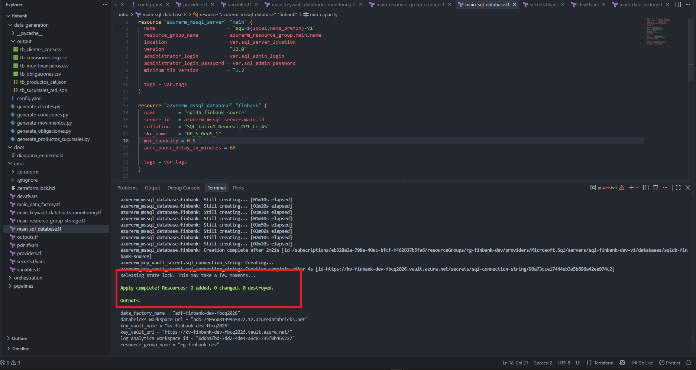

### 5.4 Generación y carga de datos sintéticos

```powershell
cd ../data-generation

# 1. Crear el archivo de conexión a SQL
```
Crea `data-generation/db_config.yaml` con este contenido:
```yaml
server: sql-finbank-dev-v1.database.windows.net   # usa el sql_server_fqdn del output de Terraform
database: sqldb-finbank-source
user: finbankadmin
password: "la-misma-password-de-secrets.tfvars"
```
```powershell
# 2. Generar los datos sintéticos (crea archivos CSV/JSON en data-generation/output/)
python generate_clientes.py
python generate_productos.py
python generate_sucursales.py
python generate_obligaciones.py
python generate_movimientos.py
python generate_comisiones.py

# 3. Cargar los datos generados a Azure SQL Database
python load_data_to_sql.py
```
Al finalizar, `load_data_to_sql.py` imprime automáticamente el `SELECT COUNT(*)` de cada tabla como confirmación.

### 5.5 Configuración de Databricks

**Paso 1 — Autenticar el Databricks CLI (una sola vez, desde tu terminal local):**

Primero necesitas un token de acceso personal:
1. Abre tu Workspace de Databricks en el navegador (URL disponible en el output `databricks_workspace_url` de Terraform, algo como `https://adb-XXXXXXXXXXXXXXXX.XX.azuredatabricks.net`).
2. Arriba a la derecha → tu ícono de usuario → **User Settings** → pestaña **Developer** → **Access tokens** → **Generate new token** → copia el token (solo se muestra una vez).

Ahora, en tu terminal local (PowerShell):
```powershell
databricks configure --token
```
Te va a pedir 2 cosas:
- **Databricks Host**: pega la URL completa del workspace (ej. `https://adb-XXXXXXXXXXXXXXXX.XX.azuredatabricks.net`)
- **Token**: pega el token que generaste arriba

**Paso 2 — Obtener el Resource ID completo del Key Vault:**

El comando de la Celda 3 necesita el **Resource ID completo** de Azure (una ruta larga tipo `/subscriptions/.../vaults/...`), no solo el nombre. Obtenlo con:
```powershell
az keyvault show --name kv-finbank-dev-fbcq2026 --query id -o tsv
```
Copia el resultado — lo vas a usar en el siguiente paso.

**Paso 3 — Crear el Secret Scope (desde tu terminal local, con el CLI ya autenticado):**
```powershell
databricks secrets create-scope kv-finbank `
  --scope-backend-type AZURE_KEYVAULT `
  --resource-id "<pega aquí el Resource ID que obtuviste en el Paso 2>" `
  --dns-name "<pega aquí el valor de key_vault_uri del output de Terraform, ej. https://kv-finbank-dev-fbcq2026.vault.azure.net/>"
```
verifica que funcionó con:
```powershell
databricks secrets list-scopes
```
Deberías ver `kv-finbank` en la lista.

**Paso 4 — Crear un clúster de cómputo (si no existe todavía):**

En el portal de Databricks → **Compute** → **Create Compute**:
- Nombre: `cluster-finbank-dev`
- Databricks Runtime: cualquier versión LTS reciente (13.3 LTS o superior)
- Tamaño de nodo: el más pequeño disponible es suficiente para este volumen de datos
- Terminación automática: 20 min para controlar costos

**Paso 5 — Subir los notebooks:**

En el portal de Databricks → panel izquierdo → **Workspace** → tu usuario → clic derecho → **Import** → arrastra los 9 archivos de la carpeta `/pipelines` de tu repositorio (o impórtalos uno por uno).

**Paso 6 — Inicializar las tablas de control (una sola vez, en este orden):**

Abre cada notebook, conéctalo al clúster creado en el Paso 4 (menú desplegable arriba del notebook), y dale **Run All**:
1. `nb_setup_control_tables.py`
2. `nb_setup_log_errores_pipeline.py`

### 5.6 Configuración de Azure Data Factory

1. En ADF Studio, crea los Linked Services:
   - `ls_databricks_finbank` (tipo Azure Databricks, apuntando al Workspace creado por Terraform, autenticación por token de Databricks)
   - `ls_sql_finbank` (tipo Azure SQL Database, usando el secreto `sql-connection-string` de Key Vault)
   - `ls_keyvault_finbank` (tipo Azure Key Vault)
2. Crea los Datasets `ds_sql_sorce` (sobre el Linked Service SQL) y `ds_adls_bronze` (sobre el Data Lake, parametrizado por tabla/año/mes/día).
3. Importa los 2 pipelines desde `/orchestration/*.json` (ADF Studio → Author → botón `{ }` de cada pipeline nuevo → pega el JSON).
4. Publica los cambios (botón "Publish all").

### 5.7 Configuración de Unity Catalog (gobierno de datos)

1. **Storage Credential**: Catalog Explorer → Create Credential → Azure Managed Identity → pega el Resource ID del Access Connector (`dbac-finbank-dev`, visible en el portal de Azure tras el `apply`).
2. **3 External Locations**, cada una apuntando a un contenedor y usando el Storage Credential del paso anterior:
   - `loc_bronze` → `abfss://bronze@<storage_account_name>.dfs.core.windows.net/`
   - `loc_silver` → `abfss://silver@<storage_account_name>.dfs.core.windows.net/`
   - `loc_gold` → `abfss://gold@<storage_account_name>.dfs.core.windows.net/`
3. **2 grupos** (Account Console → Identity and access → Groups): `rol_ingeniero`, `rol_analista`.
4. **Permisos** (Catalog Explorer → cada External Location → Permissions → Grant):
   - `rol_ingeniero`: `READ FILES` + `WRITE FILES` en las 3 ubicaciones
   - `rol_analista`: `READ FILES` únicamente en `loc_gold`
5. Agrega usuarios reales a cada grupo para poder demostrar el acceso denegado/permitido (ver sección 9.2).

### 5.8 Primera ejecución del pipeline

En ADF Studio, abre `pl_finbank_master` → **Debug** (parámetros: `filtro_tabla=""`, `run_full_load=false`). Esta primera corrida realiza el Full Load inicial de las 6 tablas. Verifica en el Storage Browser (portal de Azure) que las carpetas `bronze/`, `silver/` y `gold/` se hayan poblado correctamente.

### 5.9 Configuración manual adicional (opcional)

- **Trigger diario**: ya se crea vía Terraform (`trg-finbank-dev`), pero queda desactivado por defecto (control de costos). Actívalo cambiando `activated = true` en `main_data_factory.tf` y volviendo a aplicar Terraform.
- **CI/CD con Azure DevOps**: ver sección 10 para la configuración completa (Service Connection, Environments, Variable Group) — no es necesaria para correr el pipeline localmente, solo para el flujo de promoción `dev` → `pdn`.
### 5.10 Entornos: dev y pdn
 
El proyecto está parametrizado para dos entornos independientes (`dev.tfvars`, `pdn.tfvars`), cada uno desplegando un Resource Group completo y aislado, además de `dev` (el entorno principal de trabajo), `pdn` fue desplegado completo mediante el pipeline de CI/CD (ver sección 10).
 
### 5.11 Cumplimiento de estándares de IaC 
 
| Estándar del documento | Cómo |
|---|---|
| Ningún secreto en el código | Contraseñas y connection strings viven en Azure Key Vault; `secrets.tfvars` (con la contraseña de SQL) está en `.gitignore`, nunca se versiona; el repositorio solo incluye `secrets.tfvars.example` como plantilla vacía |
| Variables parametrizadas y documentadas | Todas las variables en `variables.tf` tienen `description`; nombres, región, tamaño de instancia  y entorno  son parametrizables |
| Backend remoto para el estado | Azure Storage Account (`sttfstatefbcq2026`, en un Resource Group separado `rg-tfstate-finbank` |
| Estado no confirmado en el repositorio | `.terraform/` y `*.tfstate*` están en `.gitignore` |
| Soporte para mas de 2 entornos | `dev.tfvars` + `pdn.tfvars`, ambos desplegados|
| Outputs exportan recursos para los scripts del pipeline | consumidos activamente por el pipeline de CI/CD (`data_factory_name` y `resource_group_name` se usan para desplegar los pipelines de ADF en `pdn`, ver sección 10.2) |

 
### 5.12 Evidencia de despliegue exitoso
 
 

 
### 5.13 Inventario de recursos
 
| Recurso | Nombre | Región | Propósito |
|---|---|---|---|
| Resource Group | `rg-finbank-dev` | East US | Contenedor lógico de todos los recursos del entorno |
| Storage Account (ADLS Gen2) | `stfinbankdevfbcq2026` | East US | Datalake con los contenedores `bronze`, `silver`, `gold` |
| Contenedor Blob | `bronze`, `silver`, `gold` | — | Las 3 capas del Medallion Architecture |
| SQL Server | `sql-finbank-dev-v1` | Central US* | Servidor  |
| SQL Database | `sqldb-finbank-source` | Central US* | Base de datos transaccional de origen  |
| Key Vault | `kv-finbank-dev-fbcq2026` | East US | Gestor de secretos (contraseñas, connection strings) |
| Secreto | `sql-admin-password`, `sql-connection-string`, `storage-connection-string`, `storage-account-key` | — | Los 4 secretos referenciados por ADF y Databricks |
| Databricks Workspace | `dbw-finbank-dev` | East US | Motor de cómputo (Premium SKU, requerido por Unity Catalog) |
| Databricks Access Connector | `dbac-finbank-dev` | East US | Identidad que usa Unity Catalog para acceder al Data Lake |
| Data Factory | `adf-finbank-dev-fbcq2026` | East US | Orquestador del pipeline |
| Log Analytics Workspace | `log-finbank-dev` | East US | Destino de los logs de diagnóstico de ADF |
 
Nota sobre la región de SQL: la ubicación general del proyecto es `East US`, pero el SQL Server se desplegó en `Central US` porque la suscripción Free Trial utilizada tiene aprovisionamiento de Azure SQL restringido en East US y East US 2. 
 
## 6. Pipeline Bronze → Silver → Gold
 
### 6.1 Bronze — Ingesta cruda
 
**Qué hace:** copia las 6 tablas desde Azure SQL Database hacia ADLS Gen2 en formato Parquet, sin transformar el esquema original, agregando 3 columnas de auditoría (`ingestion_timestamp`, `source_system`, `batch_id`) y particionando por año/mes/día.
 
**Decisión — sobrescribir la partición del día, no acumular archivos:** la primera versión generaba un archivo con nombre único por cada corrida, lo que hacía que Bronze creciera sin control si el pipeline corría varias veces el mismo día. Se cambió a un nombre de archivo fijo por partición, de forma que una segunda corrida el mismo día sobrescribe, no acumula. Esto sigue cumpliendo el requisito de "permitir la reproducción de cualquier estado anterior" a nivel de día ya que las particiones de días anteriores permanecen intactas.
 
**Decisión — checkpoint con semántica `NULL`** = en vez de una fecha fija `checkpoint_date = NULL` se interpreta automáticamente como "procesar todo" (Full Load).
 
**Decisión — filtro `>=` en vez de `>`:** para no arriesgar la pérdida de un registro que caiga exactamente en el segundo del checkpoint. Esto podría causar que la fila límite se reprocese en la siguiente corrida, pero como Silver hace `MERGE` por llave primaria, ese reprocesamiento se resuelve como una actualización idempotente, no como un duplicado.
 
**Manejo de errores por tabla:** dentro del `ForEach`, cada tabla tiene una rama de captura de error que registra el fallo en `log_errores_pipeline` sin detener el procesamiento de las demás tablas.
 
**Mejora propia — parámetros `filtro_tabla` y `run_full_load`:** agregados por valor operativo real. `pl_ppal_data_ingest` y `pl_finbank_master` aceptan un parámetro `filtro_tabla` que, si se especifica el nombre de la tabla, reprocesa unicamente esa tabla en las 3 capas (Bronze → Silver → Gold), en vez de las 6. `run_full_load` fuerza una carga completa incluso en tablas configuradas como incrementales.

 
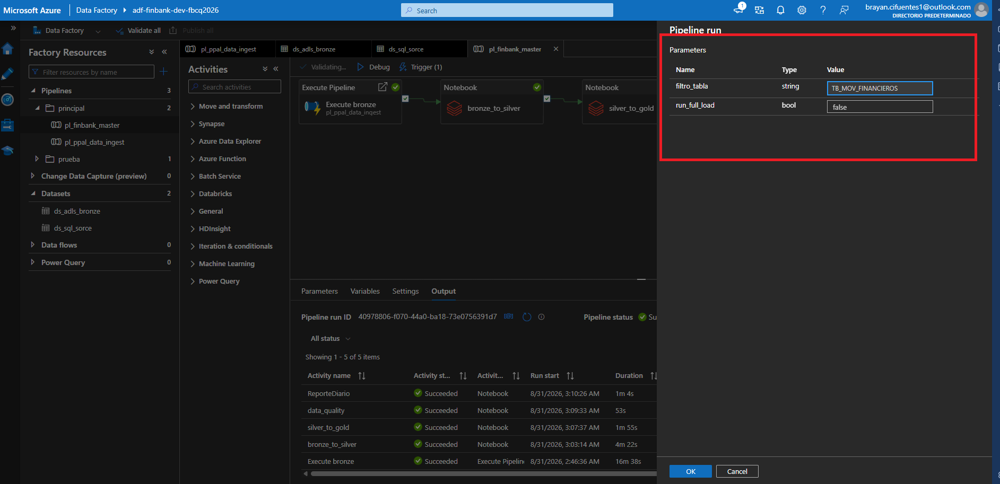
 
 
### 6.2 Silver — Limpieza y conformación
 
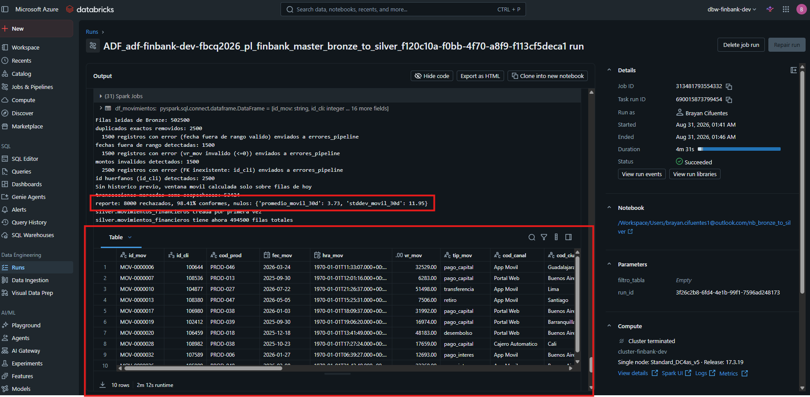

**Qué hace:** para cada una de las 6 tablas, una función que deduplica, tipa, valida integridad, aplica estrategia de nulos, enmascara y genera un reporte de calidad por ejecución.
 
**Decisión — funciones específicas por tabla, no un motor 100% generico:** a diferencia de Bronze (donde la operación es mecánica e idéntica para las 6 tablas), Silver requiere conocimiento de negocio distinto por tabla. Se generalizaron las piezas que sí son mecánicamente idénticas (`registrar_errores`, `enmascarar_columnas`, `validar_fk`, `upsert_silver`) como funciones de ayuda reutilizables.
 
**Decisión — `MERGE INTO` (upsert) en 4 de las 6 tablas:** `clientes`, `obligaciones`, `movimientos_financieros` y `comisiones` lo que hacen es leer solo la partición de hoy y realizar MERGE por llave primaria. Esto resuelve el problema de que cada corrida releyera cientos de miles de filas innecesariamente. `productos` y `sucursales` (50 y 200 filas) se dejaron con `overwrite` simple ya que el MERGE no se justifica en catálogos tan pequeños.
 
**Decisión — enmascaramiento de `nombre_completo`,documento y cuenta:** Se aplicó SHA-256 sobre `nombre_completo`, `num_doc` y `num_cuenta`, priorizando el cumplimiento literal del requisito sobre la conveniencia de mostrar nombres legibles en reportes de Gold (ver `catalogo_pii.md` para el detalle completo de columnas PII identificadas, incluyendo las que se documentó conscientemente no enmascarar, como `fec_nac` e `id_dispositivo`, con su justificación).
 
**Cálculo de `ind_sospechoso` en Silver, no en Gold:** Se calcula con una ventana móvil de 30 días por cliente (promedio y desviación estándar), marcando como sospechosa toda transacción que supere el promedio en más de 3 desviaciones estándar. La ventana usa el historial completo ya persistido en Silver
 
**Reporte de calidad por ejecución:** cada función genera una fila en `reporte_calidad_silver` con % de nulos por columna, registros rechazados, y % de conformidad como se evidencia en las figuras 

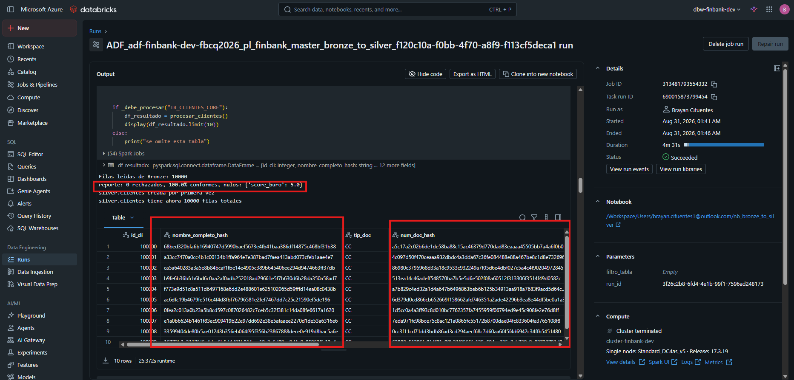
 
### 6.3 Gold — Modelo analítico
 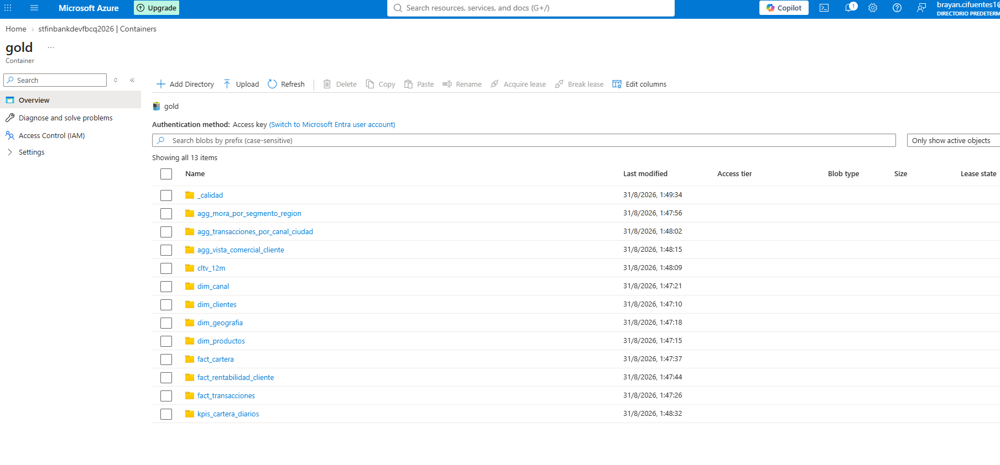
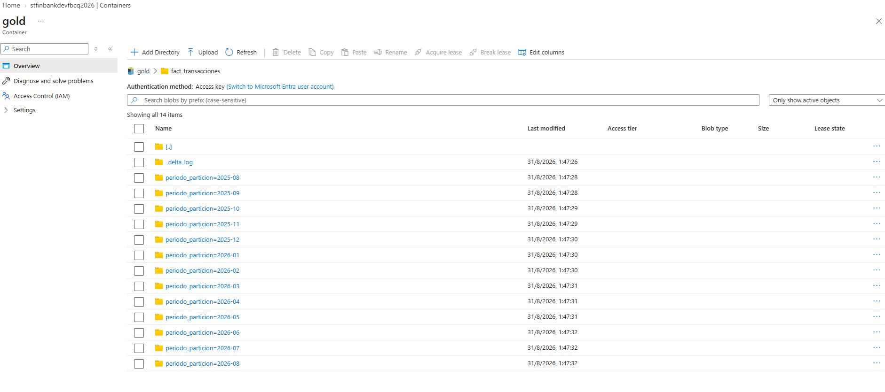

 
**Qué hace:** construye 4 dimensiones (clientes, productos, geografía, canal), 3 hechos (transacciones, cartera, rentabilidad del cliente), 3 tablas de agregación, la tabla `cltv_12m`, y la tabla de KPIs ejecutivos (`kpis_cartera_diarios`).

 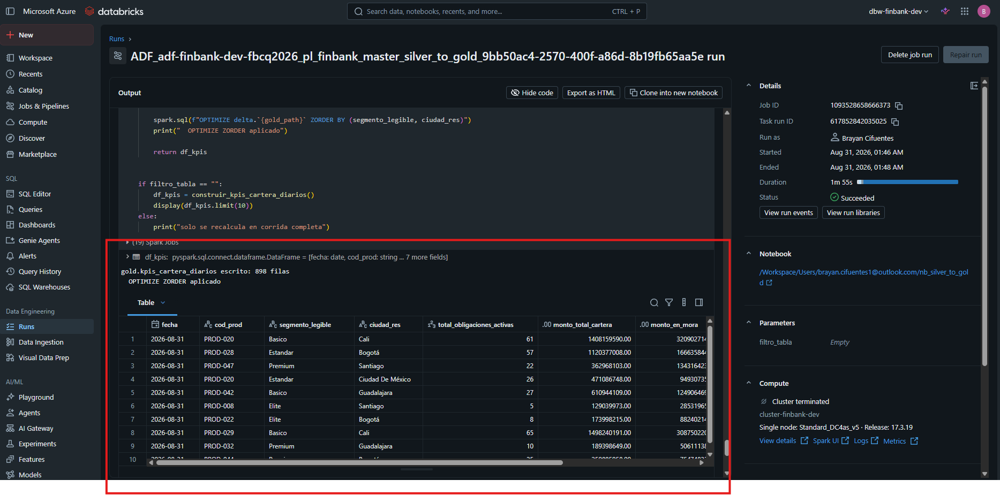
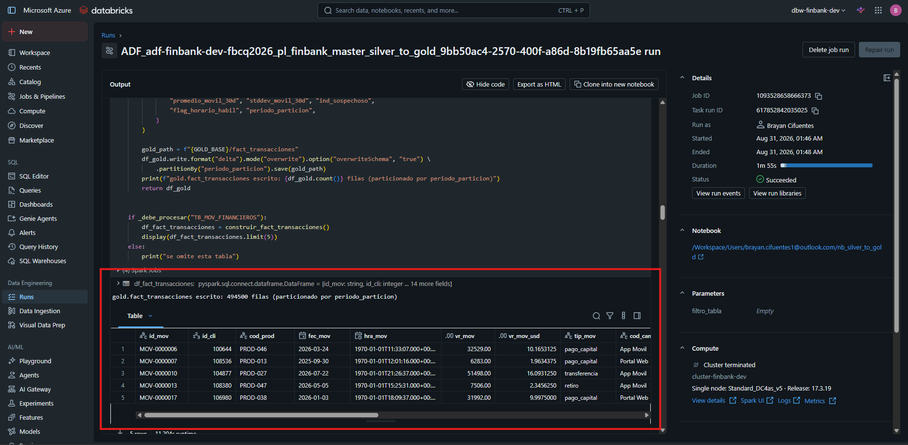
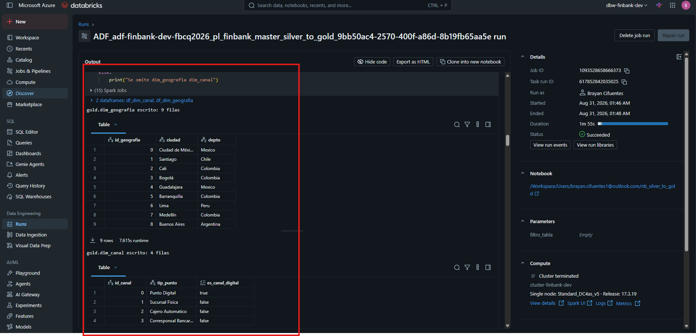

**Decisión — `overwrite` completo en cada corrida, no incremental:** a diferencia de Silver, Gold se reconstruye por completo desde Silver en cada ejecución. Esto garantiza que todas las tablas de Gold (especialmente las agregaciones, que combinan varias fuentes) queden consistentes entre sí en el mismo instante 
 
**Decisión — particionamiento selectivo, no uniforme:** se aplicó partición física por columna en las tablas grandes con una dimensión de análisis clara (`fact_transacciones` por mes, `fact_cartera` por `bucket_mora`, `fact_rentabilidad_cliente` por período, `dim_clientes` por segmento). En las tablas pequeñas pero muy consultadas (`kpis_cartera_diarios`, `agg_vista_comercial_cliente`) se usó `OPTIMIZE ZORDER` en vez de partición física 
 


 
### 6.4 Las 2 tablas de errores del proyecto
 
El proyecto implementa **2 tablas de errores distintas**, cada una con un propósito diferente 
| Tabla | error que captura |
|---|---|
| `errores_pipeline` (Silver, `_errores/`) | **Calidad de datos**: filas rechazadas por FK inexistente, fecha inválida, monto inválido |
| `log_errores_pipeline` (Bronze, `_control/`) | **Fallos operativos**: actividades de ADF que fallan (conexión SQL caída, anomalía de volumen) |

 
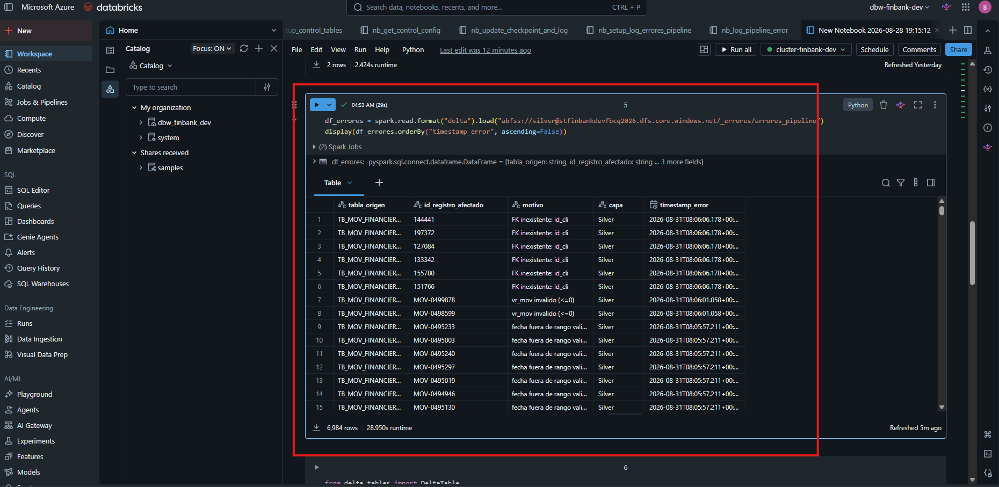
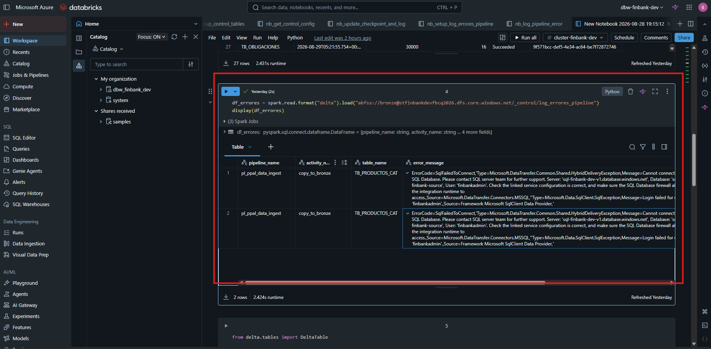
 
---
 
## 7. Reglas de Negocio Implementadas
 
 
| Regla | Dónde se calcula | Lógica |
|---|---|---|
| `bucket_mora` | Gold (`fact_cartera`) | 5 rangos sobre `dias_mora_act`: Al día (0), Rango 1 (1-30), Rango 2 (31-60), Rango 3 (61-90), Deteriorado (>90) |
| Clasificación regulatoria | Gold (`fact_cartera`) | A/B/C/D/E derivada de `bucket_mora`, con provisión estimada como % simplificado de `sdo_capital` por categoría (aproximación al principio general del Modelo de Referencia de la SFC, sin replicar el modelo estadístico completo de PDI/LGD — decisión documentada por alcance) |
| `ind_sospechoso` (detección de fraude) | **Silver** (`movimientos_financieros`) | `vr_mov > promedio_30d + 3 × desviación_estándar_30d`, ventana móvil por cliente. Calculado en Silver por requisito explícito del documento |
| CLTV | Gold (`fact_rentabilidad_cliente` + `cltv_12m`) | Suma de intereses (`tip_mov='pago_interes'`) + comisiones efectivamente cobradas (`estado_cobro='Cobrado'`) por cliente. `fact_rentabilidad_cliente` da el detalle mensual; `cltv_12m` el acumulado de 12 meses (el dataset sintético cubre exactamente ese rango, por lo que la suma total equivale al acumulado de 12 meses) |
| Monto en USD | Gold (`fact_transacciones`) | Tasa de cambio 3.200 |
| KPIs de cartera | Gold (`kpis_cartera_diarios`) | Agregación por fecha/producto/segmento/ciudad: obligaciones activas, monto total, monto en mora, tasa de mora, clientes en mora |
 
---
 
## 8. Orquestación
 
### 8.1 Dependencias y reintentos
 
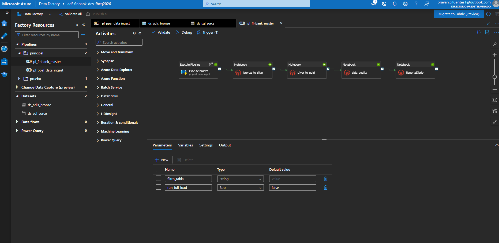
 
`pl_finbank_master` une las 4 etapas, cada actividad tiene `retry: 3` con intervalo fijo de 30 segundos.
 
**Decisión — intervalo fijo, no backoff exponencial real:** Azure Data Factory no soporta backoff exponencial nativo a nivel de política de actividad (solo un intervalo fijo entre reintentos). 
 
**Timeouts ajustados por volumen real:** en vez de un valor genérico de 12 horas en todas las actividades, se ajustaron a valores coherentes con el trabajo real de cada una (`GetControlConfig`: 15 min, `copy_to_bronze`: 1 hora, `UpdateCheckpointAndLog`: 20 min, `data_quality`: 30 min).
 
### 8.2 Manejo de errores y alertas

Se implementaron las 3 alertas requeridas utilizando la misma infraestructura base (Azure Monitor + Log Analytics + Action Group), evitando crear un mecanismo de notificación diferente para cada caso.

1. **Alerta de fallo:** cuando `copy_to_bronze` o `UpdateCheckpointAndLog` fallan, una rama de error (`dependsOn: Failed`) registra el detalle en `log_errores_pipeline` (tabla Delta) sin detener el resto del `ForEach`. Una Log Analytics Query Alert sobre `ADFActivityRun` permite identificar el pipeline, la tarea, el error y la hora, y activa el Action Group.

2. **Reporte diario de ejecución:** `nb_reporte_diario` consolida los registros procesados por capa y los rechazados por problemas de calidad en la tabla Delta `reporte_diario_ejecucion`. Una segunda Log Analytics Query Alert, basada en `ADFPipelineRun`, verifica la finalización correcta del pipeline maestro y registra su duración real directamente desde ADF.

3. **Alerta de anomalía de volumen:** compara las filas procesadas de cada tabla con el promedio de sus últimas 7 ejecuciones exitosas. Si la diferencia supera el 30 %, el notebook genera un fallo intencional utilizando la rama de manejo de errores existente. 
 
**entrega de correo no confirmada end-to-end:** el mecanismo completo (detección → registro → regla de Azure Monitor → Action Group) fue verificado con fallos reales forzados,sin embargo, las tablas de diagnóstico `ADFActivityRun`/`ADFPipelineRun` en Log Analytics permanecieron vacías durante las pruebas,una limitación que no se pudo resolver a tiempo.
 
### 8.3 Trigger diario
 
Programado a las 02:00 hora Bogotá, apuntando a `pl_finbank_master`.
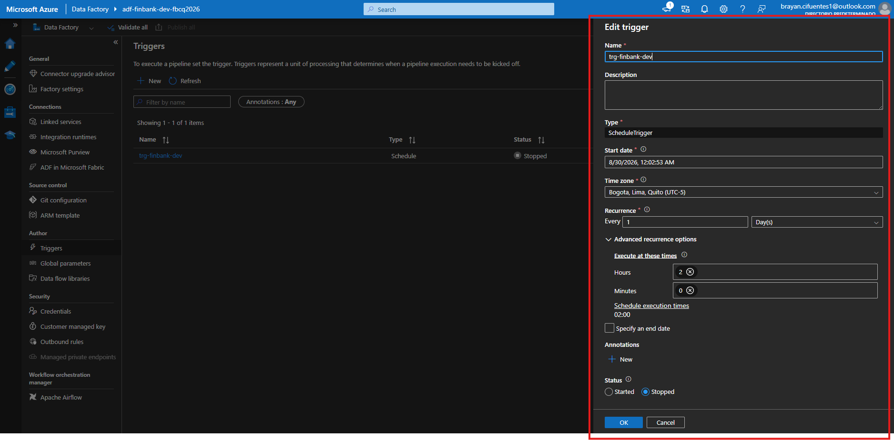
 
### 8.4 Idempotencia e incrementalidad
 
Verificado con 3 corridas reales y consecutivas del pipeline maestro:
 
| ejecucion | Proposito | Filas leídas de Bronze (movimientos) | Filas en Silver (movimientos, tras MERGE) |
|---|---|---|---|
| #1 — Full Load inicial | Carga completa limpia | 502.500 | 494.500 |
| #2 — Repetición sin cambios | Idempotencia | 2.108 (checkpoint sin avanzar) | **494.500** (idéntico) |
| #3 — Tras insertar 55 filas nuevas | Carga Delta real | 2.148 (checkpoint + nuevas) | **494.540** (+40 netas) |
 
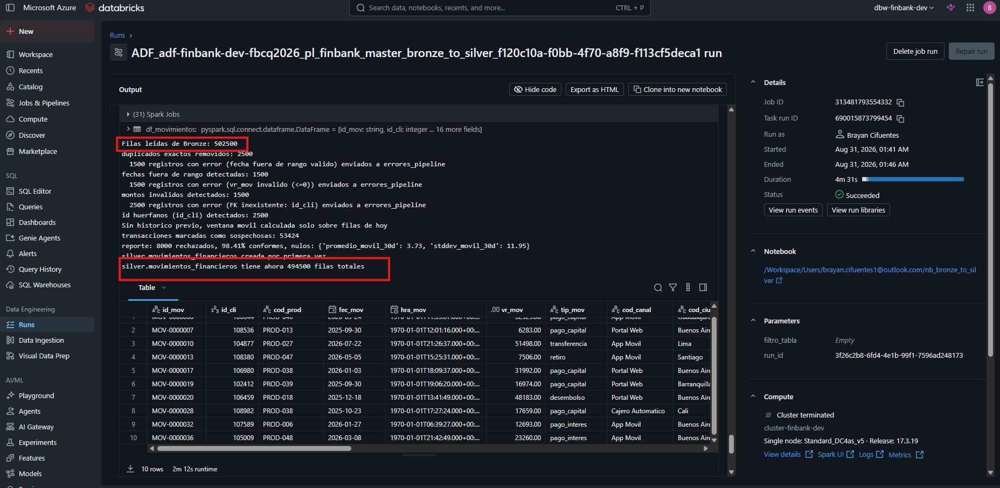
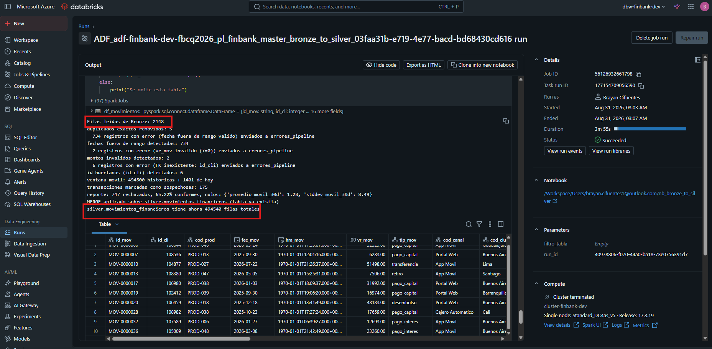
 
La ejecucion #3 usó `data-generation/insertar_datos_incrementales.py` — un script que inserta transacciones nuevas con fecha del día directamente en Azure SQL, demostrando carga Delta con datos nuevos en vez de repetir el mismo rango fijo del dataset sintético original.Silver creció exactamente en 40),la incrementalidad del checkpoint, la ausencia de duplicados vía `MERGE`, y la correcta convivencia de datos.


 
## 9. Gobierno y Seguridad
 
### 9.1 Los 3 roles:
 
**Decisión — Unity Catalog en vez de RBAC simple sobre el Storage Account:** la primera aproximación evaluada fue asignar roles de Azure (Storage Blob Data Reader/Contributor) directamente sobre los contenedores del Data Lake. Se descartó porque Databricks, tal como está configurado el acceso operativo del pipeline, usa una clave de Storage Account compartida  para leer/escribir,es decir, cualquier usuario con acceso a un notebook en el mismo clúster podría saltarsela seguridad de este, porque no está usando su identidad individual de Azure para acceder a los datos. Unity Catalog resuelve esto de raíz: es una capa de gobierno que se sitúa entre el usuario y el dato, verificando permisos por usuario en cada consulta.
 
**Componentes desplegados:**
- **Access Connector for Databricks** (Terraform): identidad administrada que Unity Catalog usa para acceder físicamente al Data Lake.
- **Storage Credential**: vincula el Access Connector con Unity Catalog.
- **3 External Locations**: (loc_bronze, loc_silver, loc_gold)
- **2 grupos de Azure Databricks**: `rol_ingeniero` y `rol_analista`, con usuarios para la demostración.
**Permisos por rol:**
 
| Rol | Bronze | Silver | Gold (lectura) | Gold (escritura) |
|---|---|---|---|---|
| Ingeniero de Datos | x | x | x | x |
| Analista |  |  | x |  |
| Administrador | x | x | x | x |

 
### 9.2 Demostración de acceso denegado y permitido
 
Se probó con usuarios reales: con la sesión del usuario Analista, un intento de lectura sobre Silver falló con el error nativo de Unity Catalog:
 
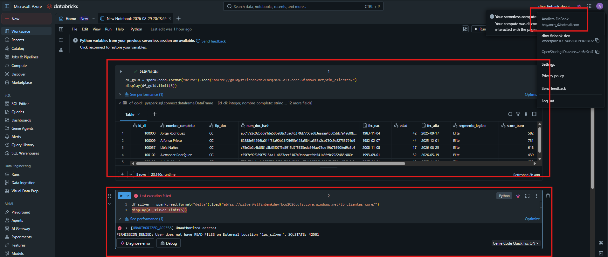
 
En la misma sesión, la lectura de gold se ejecutó exitosamente. 

Con la sesión del usuario Ingeniero, se confirmó lectura de Silver y **escritura** en Gold exitosas — demostrando el contraste completo de permisos.

 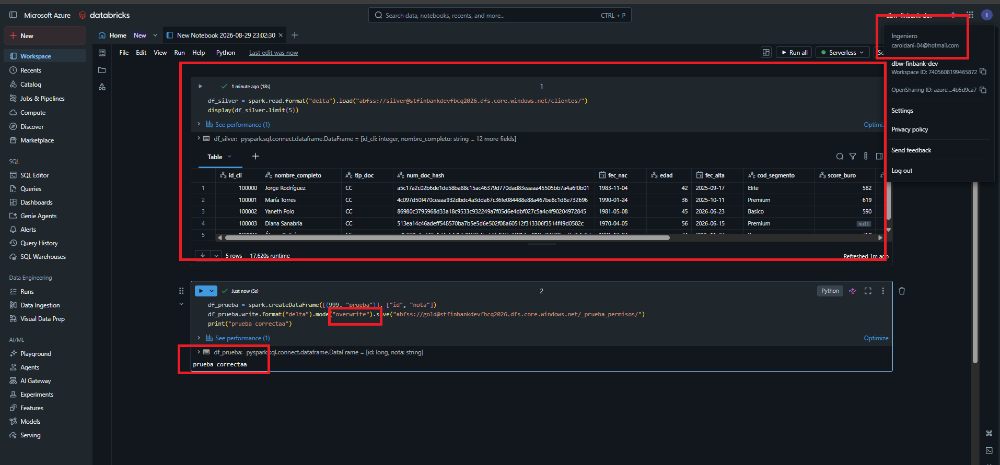
### 9.3 Principio de mínimo privilegio
 
Cada componente del pipeline opera bajo su propia identidad:
- **ADF**: identidad administrada (System Assigned), con `Storage Blob Data Contributor` sobre el Data Lake y acceso de lectura a Key Vault.
- **Unity Catalog**: Access Connector con identidad propia, separada de la de ADF.
- **Databricks**: Secret Scope respaldado por Key Vault, sin claves en texto plano en ningún notebook.
Ningún secreto (contraseña de SQL, token de Databricks, clave de Storage) aparece en código fuente.
 
 
### 9.4 Privacidad y datos sensibles
 
Ver `docs/catalogo_pii.md` para el detalle completo de identificación de columnas PII en las 6 tablas de origen, incluyendo:
- Columnas enmascaradas con SHA-256 desde Silver: `num_doc`, `num_cuenta`, `nombre_completo`.
- Columnas identificadas como PII pero conscientemente no enmascaradas, con su justificación (`fec_nac`, usada solo para derivar `edad`; `id_dispositivo`, de bajo riesgo individual y útil para análisis de fraude por canal).
### 9.5 Catálogo de datos
 
Ver `docs/catalogo_datos.md`: catálogo completo de las 6 tablas Silver y 12 objetos Gold, con cada campo documentado.
 
### 9.6 Linaje de campos calculados 
| Campo | Tabla | Origen | Transformación | Propósito de negocio |
|---|---|---|---|---|
| `bucket_mora` | `gold.fact_cartera` | `TB_OBLIGACIONES.dias_mora_act` | Clasificación en 5 rangos fijos (0, 1-30, 31-60, 61-90, >90) | Base para reportes de mora y provisión regulatoria |
| `ind_sospechoso` | `silver.movimientos_financieros` (calculado), propagado a `gold.fact_transacciones` | `TB_MOV_FINANCIEROS.vr_mov`, ventana de 30 días por `id_cli` | `vr_mov > promedio_30d + 3·desviación_30d` | Detección temprana de transacciones atípicas por cliente, para revisión de fraude |
| `cltv_12m` | `gold.cltv_12m` | `TB_MOV_FINANCIEROS.vr_mov` (tip_mov='pago_interes') + `TB_COMISIONES_LOG.vr_comision` (estado_cobro='Cobrado') | Suma de ambos por cliente en los últimos 12 meses | Medir el valor total generado por cada cliente, para segmentación comercial |
 
### 9.7 Reportes y alertas de anomalia
 
**1. Reporte diario** — `nb_reporte_diario` genera, al completarse el pipeline, un resumen real con registros por capa y rechazados por calidad.
 
**2. Alerta de anomalía de volumen**
 
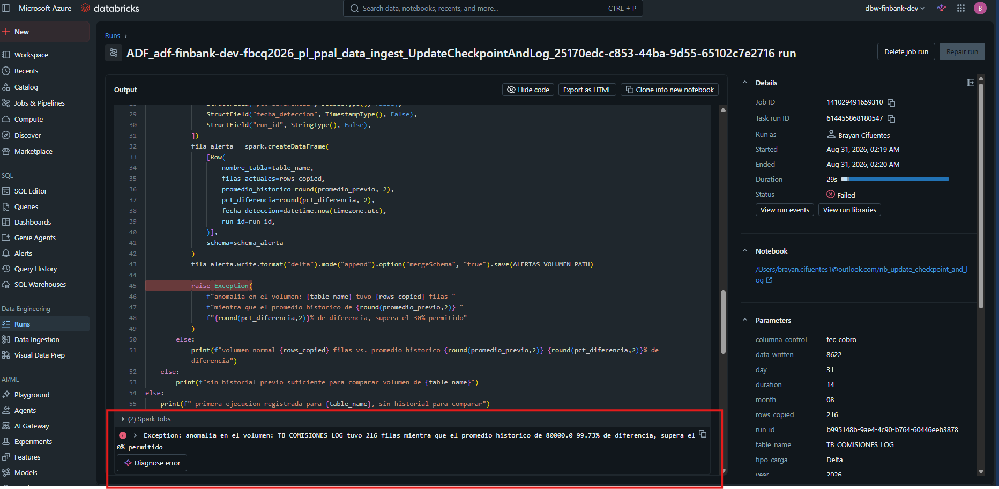
```
nombre_tabla        filas_actuales  promedio_historico  pct_diferencia
TB_MOV_FINANCIEROS  2108            502500.0            99.58%
TB_COMISIONES_LOG   216             80000.0             99.73%
```
 

 
##### el pipeline master continúa hacia Silver/Gold incluso cuando una tabla dispara la anomalía porque la rama que captura y registra el error se completa exitosamente y ADF no propaga esa falla puntual como un fallo del pipeline completo. La alerta se dispara y registra antes de que esa tabla específica complete su ciclo, cumpliendo la notificación temprana, aunque no pausa el pipeline completo de forma permanente. #####
---

## 10. Flujo en devops dev → pdn CI/CD 
 
### 10.1 Qué es y para qué sirve
 
Se implementó un pipeline de CI/CD en Azure DevOps (`azure-pipelines.yml`, en la raíz del repositorio) con 2 funciones distintas y complementarias:
 
1. **Ejecutar la infraestructura** (Terraform): crea y mantiene sincronizados los recursos de Azure entre `dev` y `pdn` (SQL Server, Storage, Databricks, Key Vault, Data Factory, Unity Catalog, alertas).
2. **actualizacion de pipelines de ADF**: despliega automáticamente los archivos JSON de `/orchestration` (los pipelines de Data Factory) directamente dentro del Data Factory de `pdn`, cada vez que cambian.
### 10.2 Flujo completo


1. Se crea una rama `feature/nombre-del-cambio` a partir de `main`.

2. Se realizan los cambios necesarios. Por ejemplo, se modifica un pipeline de ADF y se exporta su JSON en `/orchestration`.

3. Se crea un Pull Request desde la rama hacia `main`.

4. Al crear el Pull Request, Azure DevOps ejecuta automáticamente el pipeline de validación.
   - En el stage `Validar` se ejecuta `terraform plan` usando `dev.tfvars`.
   - El resultado permite revisar los cambios que se aplicarían antes de aprobar el PR.

5. Una vez aprobado y fusionado el Pull Request en `main`, se ejecuta el stage `DesplegarDev`.
   - Se realiza automáticamente `terraform apply` sobre el entorno `dev`.
   - Este entorno no requiere aprobación manual.

6. Después se inicia el stage `DesplegarPdn`, pero queda detenido hasta recibir la aprobación manual configurada en el Environment `finbank-pdn`.

7. Una vez aprobada la implementación en producción:
   - Se ejecuta `terraform apply` para crear o actualizar la infraestructura de `pdn`.


### 10.3 Estado final: ejecutado exitosamente de punta a punta
 
el entorno `pdn` fue desplegado completo a través de este pipeline de Azure DevOps, incluyendo la aprobación manual del Environment `finbank-pdn` y la carga de los pipelines de ADF.

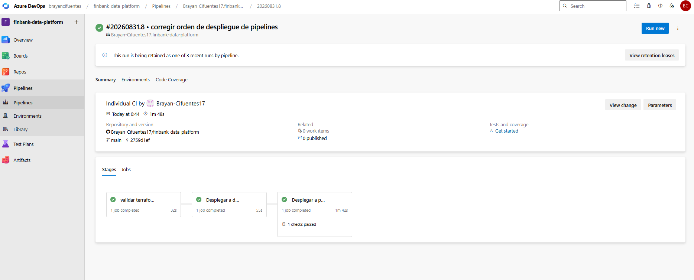
 
### 10.4 Limitación conocida y mejora futura identificada
 
Actualmente, el flujo tiene un paso manual: después de modificar un pipeline en ADF, se debe exportar su JSON y colocarlo en `/orchestration` antes de hacer el commit.

ADF también permite conectarse directamente a un repositorio para versionar los cambios automáticamente. Además, cuenta con herramientas para generar ARM templates y facilitar el despliegue mediante Azure DevOps.

Esta opción no se implementó en esta prueba por el tiempo disponible, se mantuvo el flujo actual, que aunque requiere ese paso manual, funciona correctamente y es más sencillo de implementar en el alcance del proyecto.

Como mejora futura, se plantearia integrar ADF directamente con el repositorio y automatizar también la generación y despliegue de los artefactos.


 
## 11. Evidencias adicionales
 
### 11.1 Bronze
 Storage Browser con las 6 tablas particionadas
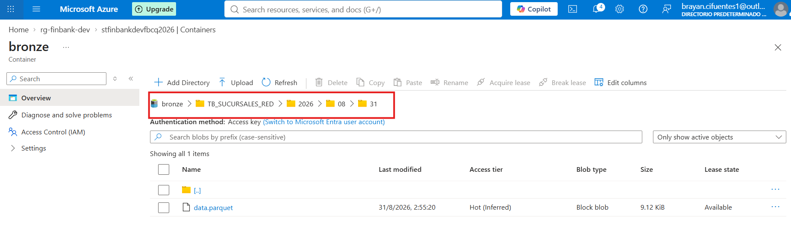
 
### 11.2 Calidad de datos
 
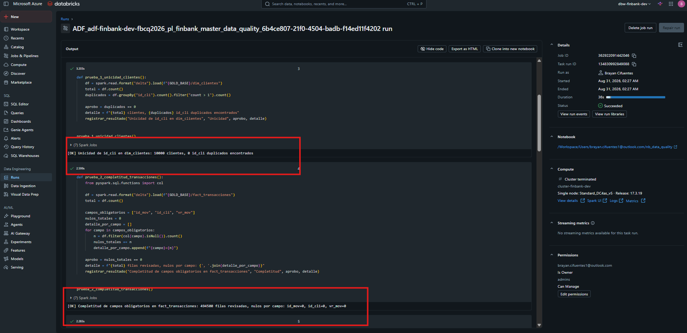
 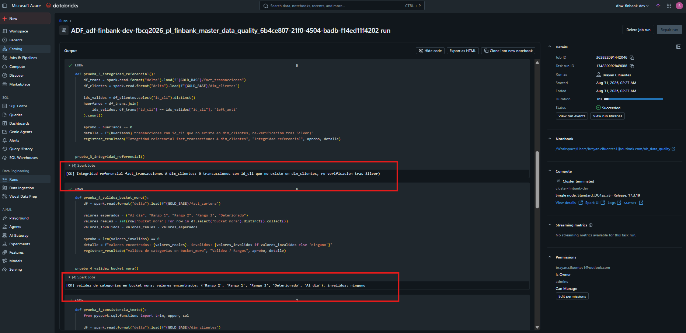
 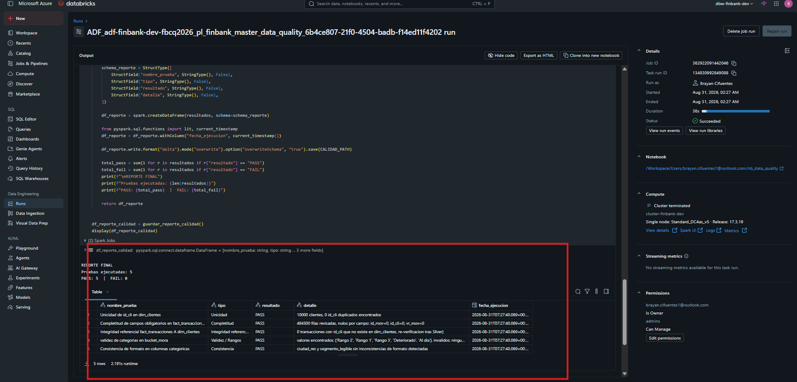


 
### 11.3 Gobierno y seguridad (Unity Catalog)

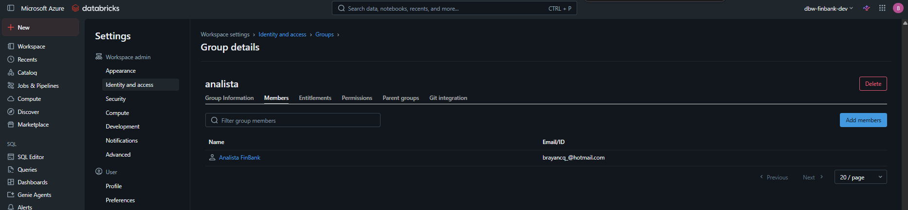
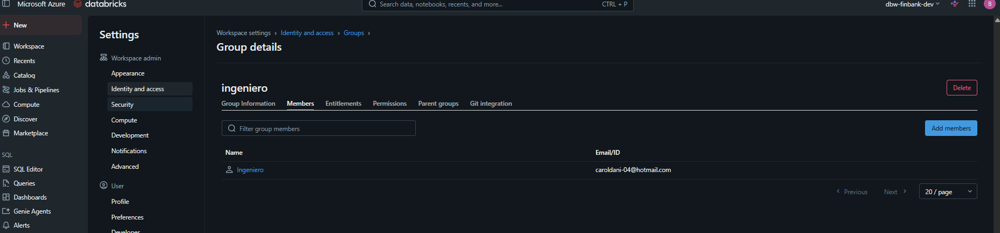

 
### 11.4 CI/CD (Azure DevOps)
 


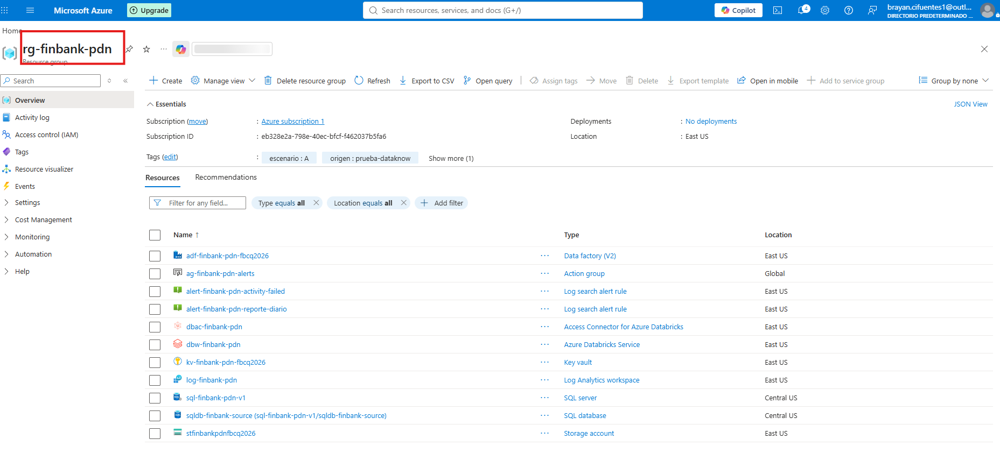

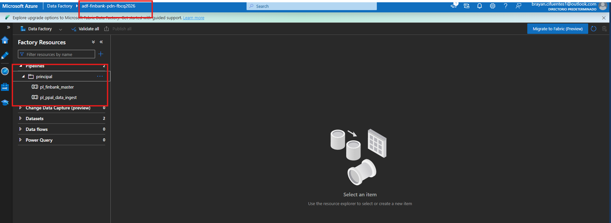
 
---